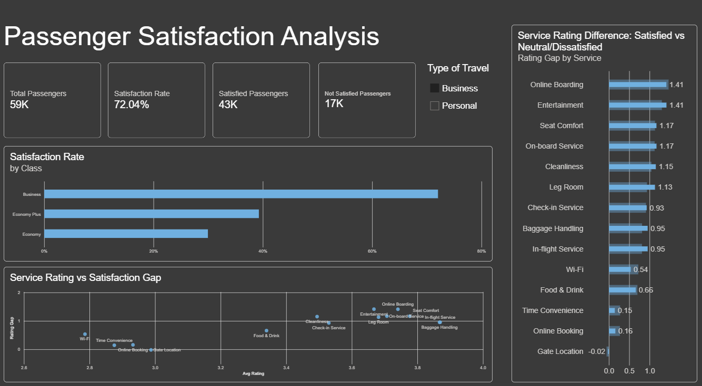

# Airline Passenger Satisfaction Analysis

## Business Question

What factors are associated with passenger satisfaction, and where should the airline focus its attention?

## Project Overview

This project analyzes **129,880 airline passenger records** to identify patterns associated with passenger satisfaction.

The analysis examines passenger characteristics, travel type, class, delays, and service ratings. **SQL Server / SSMS** was used for data cleaning, validation, and analysis, while **Power BI** was used to build an interactive dashboard and communicate the findings.

## Dashboard



## Key Findings

- Overall passenger satisfaction was **43.45%**.
- **Business travelers** had a satisfaction rate of **58.37%**, compared with **10.13%** for personal travelers.
- **Business class** had the highest satisfaction rate at **69.44%**.
- **Economy class** had the lowest satisfaction rate at **18.77%**.
- **Entertainment, seat comfort, on-board service, and leg room** showed some of the largest rating differences between satisfied and dissatisfied passengers.
- **Wi-Fi and online booking** also showed notable differences between satisfaction groups and are areas worth further investigation.

## Recommendations

Based on the analysis:

1. **Investigate digital services** such as Wi-Fi and online booking to identify potential sources of passenger dissatisfaction.
2. **Examine the experience of personal travelers**, whose satisfaction rate was substantially lower than business travelers.
3. **Prioritize service improvements** where the satisfaction-rating gap is largest.
4. Consider passenger segment and class differences when developing targeted service improvements.

These findings represent **associations rather than causal relationships** and should be validated with additional operational and customer data.

## Tools & Skills

### SQL Server / SSMS
- Data cleaning and validation
- NULL and duplicate checks
- Data quality checks
- CASE statements and derived categories
- GROUP BY and aggregations
- Analytical queries
- SQL views

### Power BI
- Data modeling
- DAX measures
- Interactive dashboards
- Slicers and visualizations
- Service comparison analysis
- Business-focused data storytelling

## Project Structure

```text
Airline-Passenger-Satisfaction/
├── README.md
├── Dashboard/
│   └── Airline_analysis.pbix
├── SQL/
│   ├── 01_Data_Cleaning.sql
│   ├── 02_Data_Validation.sql
│   ├── 03_Satisfaction_Analysis.sql
│   └── 04_Service_Analysis.sql
└── images/
    └── dashboard.png
